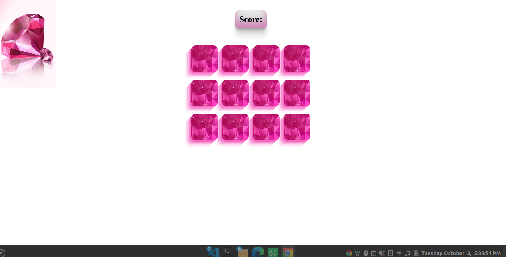

    		MEMORY GAME

It's a simple grid game, in which you as a player needs to flip over two cards. If the two cards match thats a point for you and the card is take off the board, leaving with you the remainder that you also have to flip over. The game is completed when you flipped over all the cards.

#### HTML Structure

- div.container
- h3
  - span#result
- span.notification
- div.grid

#### FLIP CARD

- flipCard()
- gets the data-id of the card
- push the id to cardsChosen & cardsChosen Array
- set the clicked card source to the cardArray item whoose position is equal to the data-id
- check if the card is equal to 2

#### CHECKFORMATCH

- checkForMatch()
- if the card chosen are the same let the clicked card be blank and let 1 be added to the score
- else it will notify you with you picked the wrong card

## RESULT

