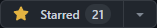
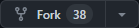

# JavaScript Beginner Projects

## Here you will get everything from click listener to api call making games and many more..

# How can I contribute in `JS beginner Project`?

<ul style="list-style-type: none; padding-left: 26px; margin: 0;">
  <li>
    1. first `star` our repo. &nbsp
    
  </li>
  <li style="padding-top: 5px;">
    2. `fork` our repo by clicking fork button. &nbsp
    
  </li>
</ul>

3. Now open local folder and then open cmd, paste `git clone https://github.com/Git21221/JS-beginner-projects.git` this command.
4. Now JS beginner Project is clonned in your local folder.
5. Create issue with proper details of issue or new features.
6. After the issue assigned to you then work on that issue.
7. Make relevant changes and then follow this command 
   `git add .` 
   `git commit -m "message"` 
   `git pull` 
   `git push <your forked repo link>`
8. Now come to our repo and make a pull request with issue link and proper screenshot.
9. We will review and merge it soon.
10. Your participation is made with us.

# Contributors

# Forks

